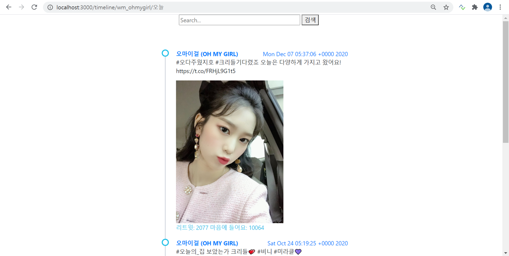

### http://khuhub.khu.ac.kr/2018110654/term-project 의 프로젝트를 깃허브로 이동하였습니다.

# 트위터 내 계정 분석 사이트

  
http://www.twitter-analyze.ml   
서버가 켜져있다면 위의 url으로 접속할 수도 있습니다.  
  

## 프로젝트 소개
검색한 트위터 계정의 **타임라인을 분석하는 사이트**입니다.   
이 프로그램은 해당 계정에서 작성한 글 뿐만 아니라 리트윗한 게시물까지 포함해 검색하거나 해당 계정의 인기있는 글들도 확인할 수 있습니다.  
  

#### 개발환경

- node.js - 12.8.1 LTS
- Express - 4.17.1
- JavaScript
- HTML5
- CSS3
- AWS

#### API

- Twitter API

## 빌드방법

> <https://developer.twitter.com/en> 
_위 링크에서 twiiter api key를 발급받고 코드에 발급받은 key를 삽입해주세요

> npm install  
> npm install twitter  
  
_terminal에서 위의 명령어를 작성해주세요_
   
     
> npm install twitter   
> npm install express   
> npm install ejs   
> node server.js    
  
_위의 명령어가 작동하지 않는다면 이 명령어로 시도하세요_
  
## 사용방법
1. 타임라인 검색 기능
   - 메인페이지에 있는 검색창에 보고싶은 계정의 아이디(ex)@twitterKorea)를 검색해 타임라인을 볼 수 있습니다.
     

2. 계정 내 검색기능
   - 해당 계정 내에서 보고싶은 게시물이 있다면 검색을 통해 볼 수 있습니다.
       

   - 이 때 내가 리트윗한 게시물도 포함해 검색합니다
      

3. 인기글 보여주기 기능
   - 현재 해당계정에서 인기있는 글들을 모아 보여줍니다.
   

## License

해당 프로그램은 MIT 라이센스를 따릅니다.
